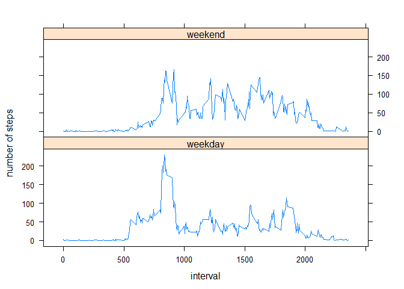

# Reproducible Research: Peer Assessment 1

## INTRODUCTION

This [Coursera](http://www.coursera.org) assignment makes use of [data](https://d396qusza40orc.cloudfront.net/repdata%2Fdata%2Factivity.zip) from a personal activity monitoring device. This device collects data at 5 minute intervals through out the day. The data consists of two months of data from an anonymous individual collected during the months of October and November, 2012 and include the number of steps taken in 5 minute intervals each day.

The variables included in this dataset are:
- steps: Number of steps taking in a 5-minute interval (missing values are coded as NA)
- date: The date on which the measurement was taken in YYYY-MM-DD format
- interval: Identifier for the 5-minute interval in which measurement was taken

## Loading and preprocessing the data

In this step, I unzip the data from the zipped directory 'activity.zip. But you can find the data [here](https://d396qusza40orc.cloudfront.net/repdata%2Fdata%2Factivity.zip) also.

```r
unzip("activity.zip")
activity <- read.csv("activity.csv", colClasses = c("numeric", "Date", "integer"))
total_activity_rows <- nrow(activity)
```
The full dataset contains 17568 rows.


## What is mean total number of steps taken per day?

For this part of the assignment, I omit the missing values.

```r
activity.na.omit <- na.omit(activity)
na.omit_activity_rows <- nrow(activity.na.omit)
```
Without the NA-values, the dataset contains 15264 rows.


```r
aggr_activity <- aggregate(steps ~ date, data = activity.na.omit, sum)
hist(aggr_activity$steps, 
     main="Histogram of total steps per day", 
     xlab="Total steps per day")
```

 

```r
aggr_mean <- mean(aggr_activity$steps)
aggr_median <- median(aggr_activity$steps)
```

The mean of the total steps per day is 1.0766189\times 10^{4}.  
And the median is 1.0765\times 10^{4}.


## What is the average daily activity pattern?

Make a time series plot of the 5 minute interval (column 'interval') and the average (mean) steps taken, averaged across all days

```r
require("ggplot2")
```

```
## Loading required package: ggplot2
```

```r
aggr_activity <- aggregate(steps ~ interval, data=activity.na.omit, mean)
g <- ggplot(aggr_activity , aes(interval, steps))
p <- g + geom_line(size=1)            
p <- p + labs(title = "Average steps per interval")
p
```

 

```r
max_steps <- max(aggr_activity$steps)
interval_max_steps <- aggr_activity$interval[(aggr_activity$steps==max_steps)]
```

The maximum average steps on an interval is 206.1698113, on interval 835.

## Imputing missing values

Note that there are a number of days/intervals where there are missing values (coded as NA). The presence of missing days may introduce bias into some calculations or summaries of the data.


```r
nr_na_values <- length(which(is.na(activity)))
```
The number of missing values in the dataset is 2304.
For the missing values, I fill in the mean of that interval from other days.


```r
new_activity <- activity

for (i in 1:nrow(activity)){
  if (is.na(activity[i,1])){
      new_steps <- aggr_activity[aggr_activity$interval==activity[i,3],2]      
      new_activity[i,1] <- new_steps
  }
}
aggr_new_activity <- aggregate(steps ~ date, data = new_activity, sum)
hist(aggr_new_activity$steps, 
     main="Histogram of total steps per day (incl. NA's)", 
     xlab="Total steps per day")
```

 

```r
new_mean <- mean(aggr_new_activity$steps)
new_median <- median(aggr_new_activity$steps)
```

The mean of the total steps per day is 1.0766189\times 10^{4} (was without NA's 1.0766189\times 10^{4}.  
And the median is 1.0766189\times 10^{4} (was without NA's 1.0765\times 10^{4}.


## Are there differences in activity patterns between weekdays and weekends?

Add an extra column 'weekdays' to distinguish between weekend (Saturday/Sunday) and the rest of the week (weekday). To simulate the type of panel plot, I load the 'lattice' package.


```r
require("lattice")
```

```
## Loading required package: lattice
```

```r
## set local language to English (this works on Windows, see settings for different operating systems)
Sys.setlocale("LC_TIME", "English_United States.1252");
```

```
## [1] "English_United States.1252"
```

```r
weekend_days <- c("Sat", "Sun")
for (i in 1:nrow(new_activity)){
  if (weekdays(new_activity[i,2],abbreviate=T)!=weekend_days[1] 
      && weekdays(new_activity[i,2],abbreviate=T)!=weekend_days[2]){
      new_activity[i,"weekdays"] <- "weekday"
  }else{
      new_activity[i,"weekdays"] <- "weekend"
  }
}
aggr_new_activity_weekdays <- aggregate(steps ~ interval + weekdays, data = new_activity, mean)
xyplot(steps ~ interval | weekdays, aggr_new_activity_weekdays,
       type = "l", layout=c(1,2), ylab = "number of steps")
```

 

The above graph shows differences between weekdays and weekend-days.
